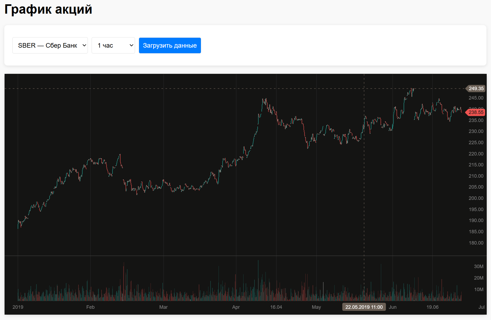

# Visualizer - Визуализация биржевых данных

Демонстрационное веб-приложение для визуализации исторических биржевых данных с использованием Go, PostgreSQL и DXCharts Lite. Используется для визуализации работы загрузчика [market-loader](https://github.com/motylkov/market-loader).

## Возможности

- **Динамический выбор инструментов** - загрузка доступных инструментов из базы данных
- **Гибкие интервалы** - поддержка различных временных интервалов (1 минута, 5 минут, 1 час, 1 день и т.д.)
- **Интерактивные графики** - свечные графики с объемами торгов
- **REST API** - полноценное API для получения данных
- **Кросс-платформенная сборка** - поддержка Windows, Linux, macOS

>Демонстрационное приложение максимально упрощено и не обременено сложной архитектурой.

## Интерфейс



## Технологии

- **Backend**: Go 1.24+, Fiber (веб-фреймворк)
- **Database**: PostgreSQL
- **Frontend**: HTML5, JavaScript, DXCharts Lite
- **Configuration**: YAML
- **Build**: Makefile для кросс-платформенной сборки

## Требования

- Go 1.24 или выше
- PostgreSQL 17 или выше
- Make (для сборки)

## Установка

### 1. Клонирование репозитория

```bash
git clone <repository-url>
cd visualizer
```

### 2. База данных

Для создания структуры базы данных и заполнения её данными используйте отдельный репозиторий:

**[github.com/motylkov/market-loader](https://github.com/motylkov/market-loader)**

Этот репозиторий содержит:
- Загрузчик данных с API Т-Инвестиций
- Инструкции по настройке и использованию

Следуйте инструкциям в репозитории для:
1. Создания структуры базы данных
3. Загрузки инструментов и исторических данных
4. Включения нужных инструментов для визуализации


### 3. Настройка конфигурации

Скопируйте пример конфигурации и настройте параметры подключения к БД:

```bash
cp config/config.example.yaml config/config.yaml
```
Отредактируйте `config/config.yaml`.


### 4. Запуск

### Сборка для текущей платформы

```bash
# Сборка под текущую ОС (автоматическое определение)
make build

# Запуск собранного бинарника
make run
```

Бинарные файлы будут созданы в папке `bin/`.


Сервер запустится на `http://localhost:8080`


### 5. Разработка

### Локальная сборка

```bash
# Установка зависимостей (при первом запуске)
make deps

# Быстрый запуск для разработки
make dev

# Или напрямую
go run ./cmd
```

### Кросс-платформенная сборка

```bash
# Сборка для конкретной платформы
make build-windows    # Windows (amd64)
make build-linux      # Linux (amd64)
make build-darwin     # macOS (amd64 + arm64)

# Очистка
make clean
```


## Веб-интерфейс

1. Откройте браузер и перейдите на `http://localhost:8080`
2. Выберите инструмент из выпадающего списка
3. Выберите временной интервал
4. Нажмите "Загрузить данные"

### API Endpoints

- `GET /` - Главная страница с графиком
- `GET /api/instruments` - Список доступных инструментов
- `GET /api/intervals` - Список доступных интервалов
- `GET /api/candles?figi=FIGI&interval=INTERVAL` - Данные свечей
- `GET /api/debug` - Диагностическая информация

## Конфигурация

### Параметры базы данных

- `host` - адрес сервера PostgreSQL
- `port` - порт PostgreSQL (по умолчанию 5432)
- `user` - имя пользователя
- `password` - пароль
- `dbname` - имя базы данных
- `sslmode` - режим SSL (disable, require, verify-full)

### Поддерживаемые интервалы

- `CANDLE_INTERVAL_1_MIN` - 1 минута
- `CANDLE_INTERVAL_5_MIN` - 5 минут
- `CANDLE_INTERVAL_15_MIN` - 15 минут
- `CANDLE_INTERVAL_30_MIN` - 30 минут
- `CANDLE_INTERVAL_HOUR` - 1 час
- `CANDLE_INTERVAL_DAY` - 1 день
- `CANDLE_INTERVAL_WEEK` - 1 неделя
- `CANDLE_INTERVAL_MONTH` - 1 месяц

## Отказ от ответственности
Этот проект представляет собой демонстрационный инструмент для визуализации рыночных данных. Авторы и правообладатели не несут никакой ответственности за ваши торговые решения, финансовые потери, упущенную выгоду или любые другие убытки, прямо или косвенно связанные с использованием данного программного обеспечения. Вы должны полностью осознавать эти риски и 
иметь соответствующий опыт, прежде чем принимать какие-либо торговые решения. Вы самостоятельно несете ответственность за проведение собственного анализа.

- **НЕ является торговой системой** или финансовым советником

- **НЕ предоставляет инвестиционных рекомендаций**

- **НЕ гарантирует прибыльность** торговых операций

## Disclaimer
This project is a demonstration tool for visualizing market data. The authors and copyright holders are not responsible for your trading decisions, financial losses, lost profits, or any other damages directly or indirectly related to the use of this software. You must be fully aware of these risks and have the appropriate experience before making any trading decisions. You are solely responsible for conducting your own analysis.

- **Is NOT a trading system** or financial advisor

- **Does NOT provide investment recommendations**

- **Does NOT guarantee profitability** of trading operations

## Лицензия

Этот проект распространяется под лицензией Mozilla Public License 2.0 (MPL-2.0). См. файл [LICENSE](LICENSE) для получения дополнительной информации.

**Copyright (C) 2025 Maxim Motylkov**